# Architecture

Isolated VM-based development environment designed for Claude Code usage. A configurable host directory is mounted into the VM so Claude can work inside the VM while files live on the host machine.

```mermaid
graph TB
  %% ── Actors ──
  User(["🧑‍💻 User (Developer)"])
  Agent(["🤖 Agent (Claude Code)"])

  %% ── Host Machine ──
  subgraph Host["🖥️ Host Machine"]
    direction TB
    subgraph Repo["📦 vm_dev Repo"]
      direction LR
      Justfile[/"Justfile"/]
      Tofu[("OpenTofu\nConfig")]
      EnvFile[".env"]
      ClaudeConfig["claude_config/"]
    end
    SharedDir[["📂 Shared Directory\n(mounted into VM)"]]
  end

  %% ── Virtual Machine ──
  subgraph VM["☁️ Virtual Machine (Ubuntu minimal)"]
    direction TB
    subgraph Infra["⚙️ Infrastructure"]
      LXD{{"LXD / QEMU / KVM"}}
    end
    MountPoint[["📂 Mounted Host Directory"]]
    Claude["🤖 Claude Code"]
  end

  %% ── Actor → Host relationships ──
  User -.->|configures| Repo
  User -.->|operates| Host

  %% ── Provisioning ──
  Tofu ==>|provisions| VM
  Justfile -->|orchestrates| Tofu

  %% ── Runtime ──
  LXD -->|manages| VM
  SharedDir <-->|"bind mount"| MountPoint
  Claude -->|reads & writes| MountPoint

  %% ── Agent ──
  Agent ==>|works inside| VM

  %% ── Styles ──
  classDef actor fill:#818cf8,stroke:#4f46e5,color:#fff,stroke-width:2px
  classDef infra fill:#f97316,stroke:#c2410c,color:#fff,stroke-width:2px
  classDef repo fill:#22d3ee,stroke:#0891b2,color:#000,stroke-width:2px
  classDef mount fill:#a3e635,stroke:#65a30d,color:#000,stroke-width:2px,stroke-dasharray:5 5
  classDef tool fill:#f0abfc,stroke:#c026d3,color:#000,stroke-width:1px

  class User,Agent actor
  class LXD infra
  class Repo repo
  class SharedDir,MountPoint mount
  class Justfile,Tofu,EnvFile,ClaudeConfig tool
```

