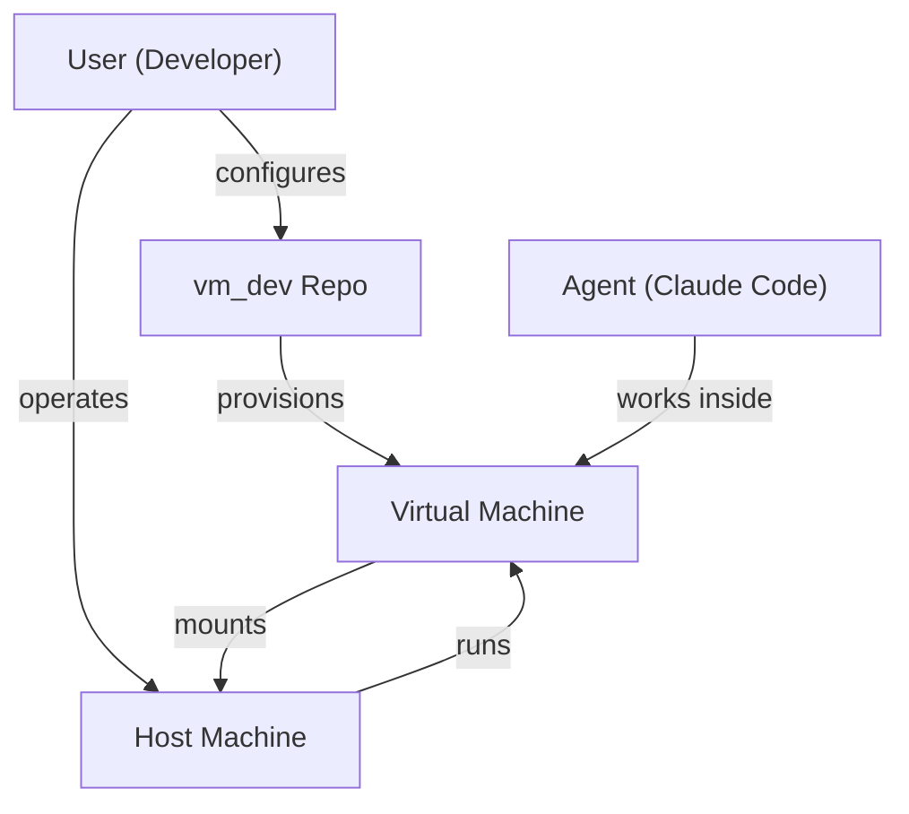

# Architecture

High-level overview of the vm_dev system.

```mermaid
graph TB
  User["User (Developer)"]
  Agent["Agent (Claude Code)"]
  Host["Host Machine"]
  Repo["vm_dev Repo"]
  VM["Virtual Machine"]

  User -->|configures| Repo
  User -->|operates| Host
  Repo -->|provisions| VM
  Host -->|runs| VM
  Agent -->|works inside| VM
  VM -->|mounts| Host
```
